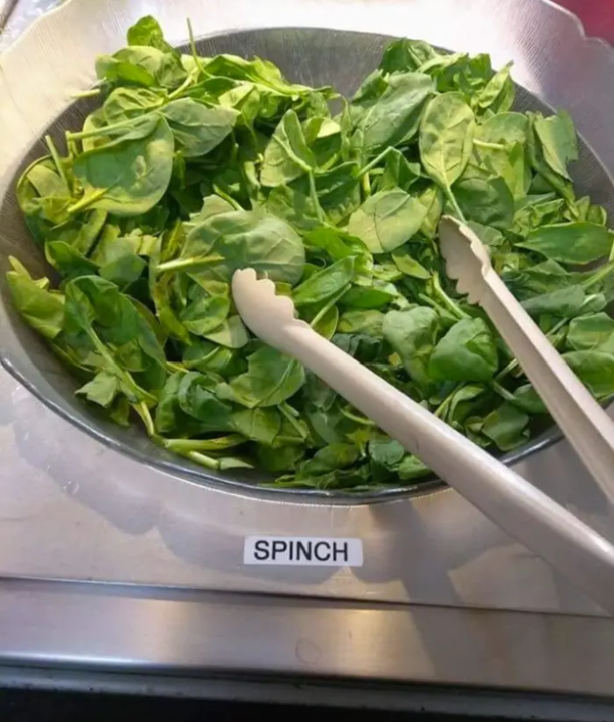

# Spinch-Shell
Ultra lightweight POSIX-style shell for Linux written in C
Thomas Kaunzinger - Fall 2019

This shell implements most of the basic POSIX-style commands
and operations, including piping, file redirection, variable
storing and recalling, backgrounding, logical operators, etc.

The program can be launched standalone interactively or can	
input a .sh file for one-off script execution.				

Some features are still TODO and I will eventually update
them at a later date so that I don't drive myself insane, but
likely not for a while due to my own personal time constraints.

These missing features include...
- Sub-command in parentheses support
- Commands with inputs in quotation marks
- Escape characters for newline ignoring
- Order of operations might not be 100% correct in parsing
- Might want to use a hashmap instead of vectors for variables
- Show working directory instead of just spinch$
- Improve cd for its different modes of operation
- Autocomplete and command history?

